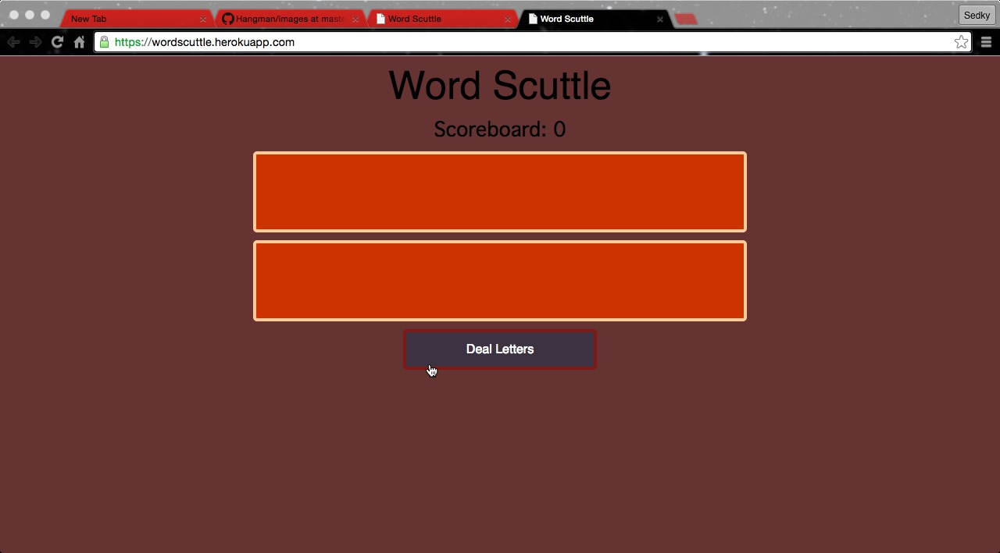
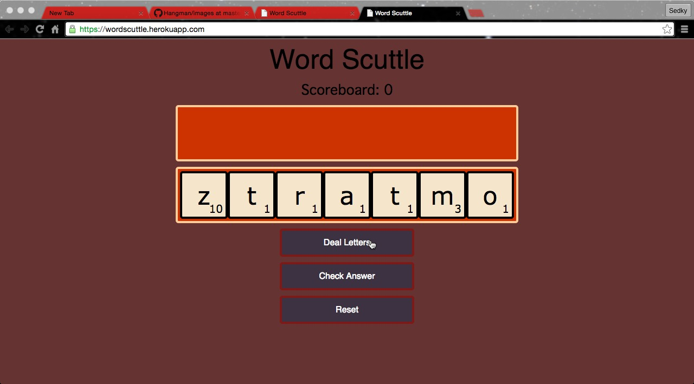
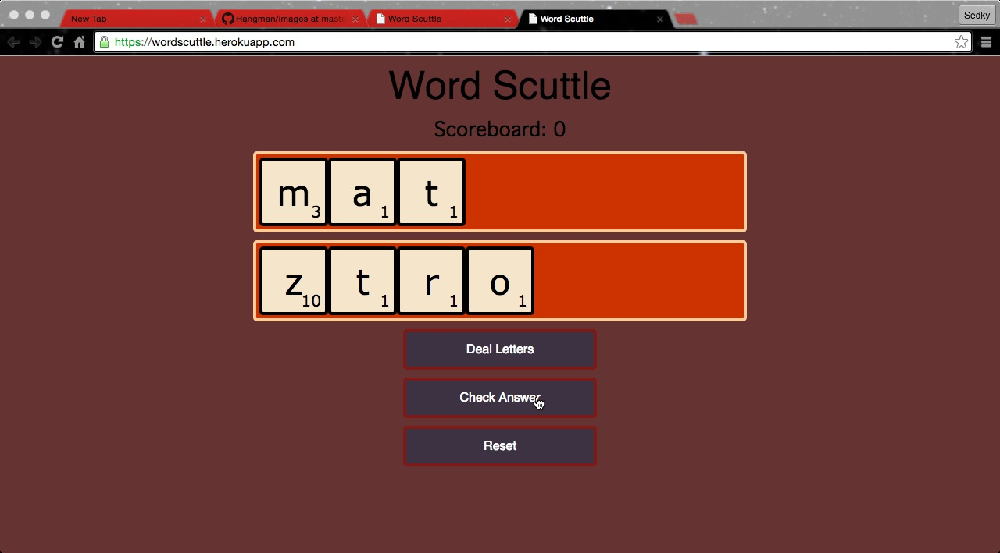
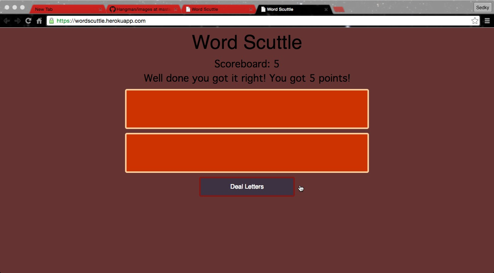
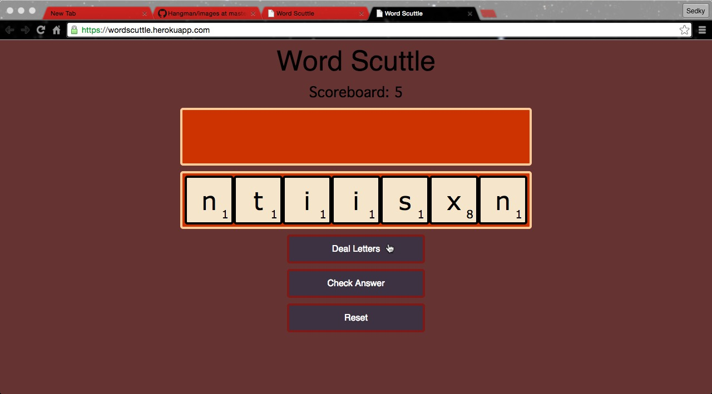
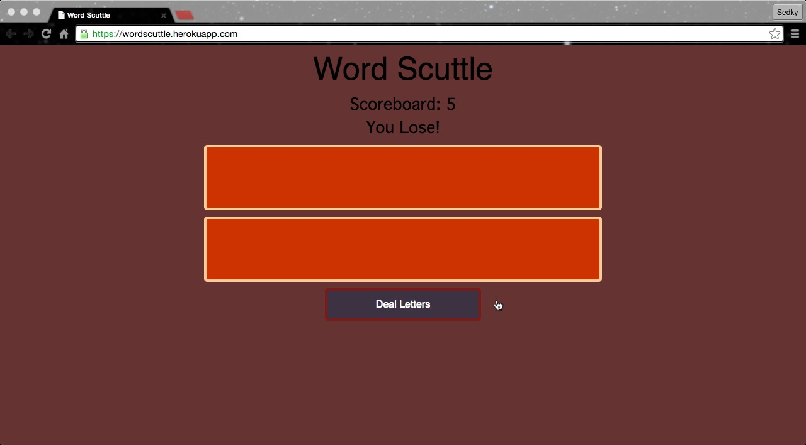

# Word-Scuttle

## WDI-LDN-16 - Project 1

#### Single player Scrabble! [Play it here!](https://wordscuttle.herokuapp.com/ "Here!")

In this word game your objective is to make the highest scoring word possible in your hand until you can't!

## Instructions

1.  The player clicks on the Deal Letters button.

2.  The player chooses and clicks on a letter in the Player's Hand to be placed in the Player's Guess.

3. Once the player has formed a word, they click the Check Answer button.

4. If your answer is correct, your score is added and you play again. If your answer is incorrect, your lose! 

5. If you lose, press the Reset button to start again.

####Approach / How it works

When the user clicks the Deal Letters button random letters are generated allowing the user to form words from the tiles. 

Once the user clicks the Check Answer button it is checked using a library made from an online dictionary API. 

When an answer is played the board will clear. If the answer is correct the user score will be displayed. If the answer is incorrect the user loses the game.

 The biggest problem was getting the point value for each letter to score the word.

####The Build

* HTML 5, CSS and jQuery were used to create this game. 
* Animation was created using the Animate.css stylesheet.  

#### Problems & Challenges

The biggest problem was getting the point value for each letter to score the word.

